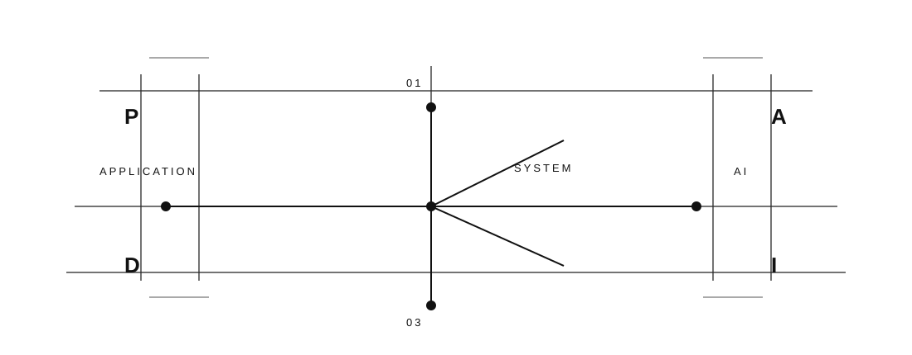

# PAVAN KARTHIKEYA

  
FULL-STACK DEVELOPER

  
BACKEND · SYSTEM DESIGN · AI

  
Building reliable applications and exploring intelligent systems.

  

    <a href="https://github.com/Pavankarthikeya08" style="color: #58a6ff;">GitHub</a> ·
    <a href="https://linkedin.com/in/rt-pavan-karthikeya" style="color: #58a6ff;">LinkedIn</a> ·
    <a href="mailto:rtpavankarthikeya@gmail.com" style="color: #58a6ff;">Email</a>
  

## 01 / ABOUT

Full-stack developer focused on building complete applications across React, Node.js, APIs and databases. Interested in backend architecture and the practical use of AI, especially LLM applications, RAG and agentic workflows. Currently going deeper into system design and scalable backend engineering.

## 02 / CURRENTLY LEARNING

  

    
01

    
SYSTEM DESIGN

    
Architecture · APIs · Scalability

  

  

    
02

    
AI APPLICATIONS

    
LLMs · RAG · Agentic AI

  

  

    
03

    
BACKEND

    
Node · Express · Databases

  

  

    
04

    
ENGINEERING

    
DSA · DBMS · Core CS

  

## 03 / PROJECTS

<table>
  <tr>
    <td valign="top" style="padding: 16px 14px; border: 1px solid #30363d; border-radius: 14px; background: rgba(13,17,23,0.9); width: 33%;">
      
01 / QUERYAI

      
QueryAI

      
AI-powered natural-language database assistant.

      
React · Node · Express · SQLite · MySQL · Gemini

      
95% query-generation accuracy

      
5+ interactive dashboards

    </td>
    <td valign="top" style="padding: 16px 14px; border: 1px solid #30363d; border-radius: 14px; background: rgba(13,17,23,0.9); width: 34%;">
      
02 / VEXA

      
Vexa

      
MERN project-management platform.

      
React · Node · Express · MongoDB

      
Task tracking · RBAC · Milestones · Email workflows

    </td>
    <td valign="top" style="padding: 16px 14px; border: 1px solid #30363d; border-radius: 14px; background: rgba(13,17,23,0.9); width: 33%;">
      
03 / ANYSHARE

      
AnyShare

      
Secure file-sharing platform.

      
Node · Express · MongoDB · Cloudinary · Multer

      
100+ users

      
Unique download IDs · Cloud storage

    </td>
  </tr>
</table>

## 04 / STACK

### LANGUAGES

### FRONTEND

### BACKEND

### DATA

### AI / GENAI
Gemini API · LLM Applications · Prompt Engineering · RAG · Agentic AI

### TOOLS

## 05 / CONNECT

  
LET'S BUILD.

  

    <a href="https://github.com/Pavankarthikeya08" style="color: #58a6ff;">GitHub</a> ·
    <a href="https://linkedin.com/in/rt-pavan-karthikeya" style="color: #58a6ff;">LinkedIn</a> ·
    <a href="mailto:rtpavankarthikeya@gmail.com" style="color: #58a6ff;">Email</a>
  

