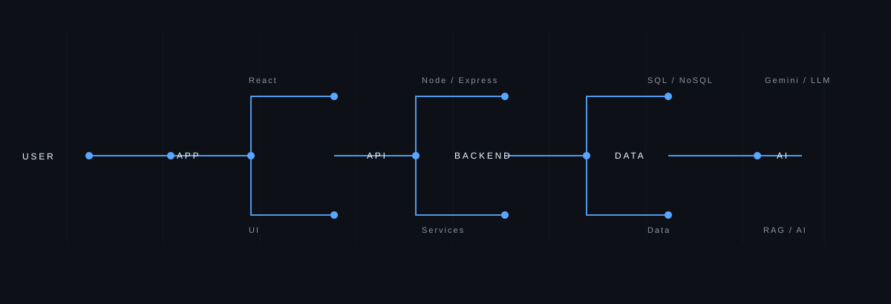

## ABOUT

Full-stack developer building complete products across backend, APIs, and data systems. Interested in scalable architecture, backend engineering, and practical AI workflows with LLMs and RAG.

## CURRENTLY LEARNING

- System design and API architecture
- LLM apps, RAG, and agent workflows
- Backend engineering with Node.js and databases
- Core engineering fundamentals

## PROJECTS

- QueryAI — Natural-language database assistant with dashboards and query generation. Technologies: React, Node.js, Express, SQLite, MySQL, Gemini.
- Vexa — Project-management platform with tasks, RBAC, milestones, and workflows. Technologies: React, Node.js, Express, MongoDB.
- AnyShare — Secure file-sharing app with uploads, sharing, and delivery. Technologies: Node.js, Express, MongoDB, Cloudinary, Multer.

## TECH STACK

### LANGUAGES

  

### FRONTEND

  

### BACKEND

  

### DATABASES

  

### AI / GENAI

LLM APPLICATIONS · RAG · PROMPT ENGINEERING · AGENTIC AI

### TOOLS

  

## CONNECT

[GitHub](https://github.com/Pavankarthikeya08) · [LinkedIn](https://linkedin.com/in/rt-pavan-karthikeya) · [Email](mailto:rtpavankarthikeya@gmail.com)

